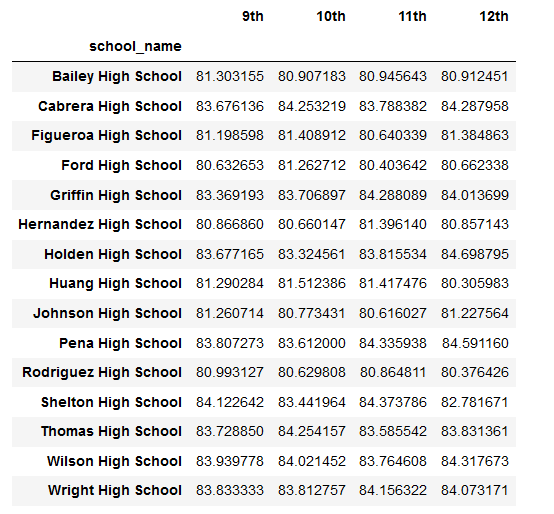

# School_District_Analysis

The purpose of this analysis is to see if there are any discrepencies in the math and reading scores at Thomas High School as there are evidence of academic dishonesty.

How is the district summary affected?

The previous district analysis:
- % passing math - 75%
- % passing reading - 86%
- % overall passing - 65%

The new district analysis:
- % passing math - 73.9%
- % passing reading - 84.7%
- % overall passing - 64.1%

# How is the school summary affected?
Comparing two schools to see if the results changed: 
- Ford High School - % passing reading - 68.3%
                   - % passing reading - 79.3%
                   
- Baily High School - % passing reading - 81.9%
                    - % passing math - 66.7%
                    

Comparing the new Analysis with the two same schools:
- Ford High School - % passing reading - 68.3%
                   - % passing reading - 79.3%
                   
- Baily High School - % passing reading - 81.9%
                    - % passing math - 66.7%

As we can see the were no changes.

How does replacing the ninth graders’ math and reading scores affect Thomas High School’s performance relative to the other schools?

How does replacing the ninth-grade scores affect the following:

# Math and reading scores by grade:
These below images are before the Nans were taken out:

The below images are after the Nans:

# Scores by school spending: 
School spending increased after taking the Nan from Thomas High School.  
Below are the comparisons of before and after

# Scores by school size:
Comparing before and after: As we compare the two we can see that the overall passing % increased after the taking out Nans. 

# Scores by school type:
Comparing before and after: As we compare the two we can see that the school type overall passing % didn't change.

Summary: Summarize four major changes in the updated school district analysis after reading and math scores for the ninth grade at Thomas High School have been replaced with NaNs.
